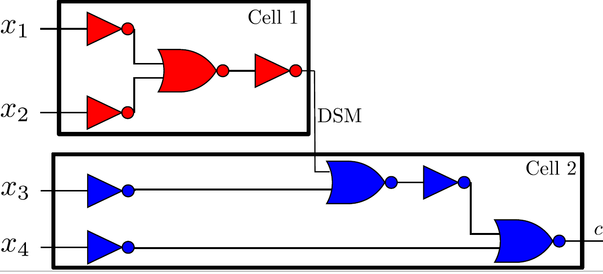
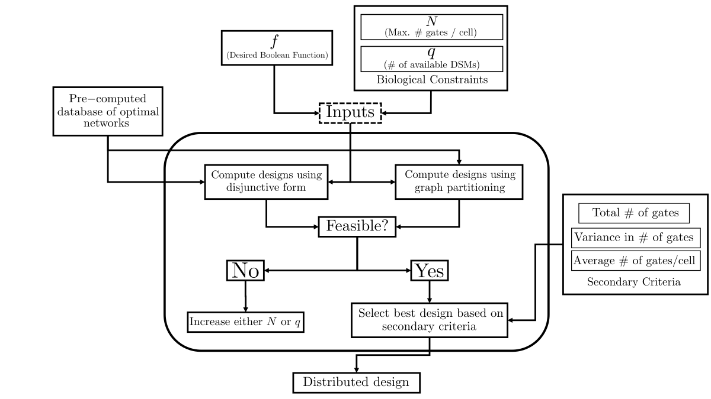
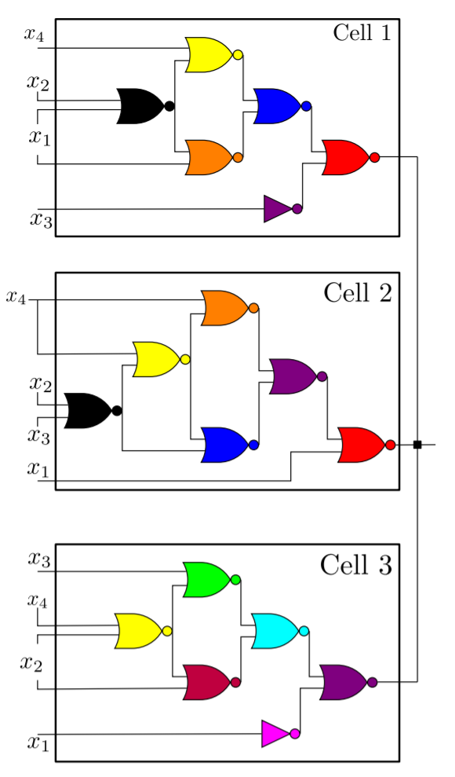
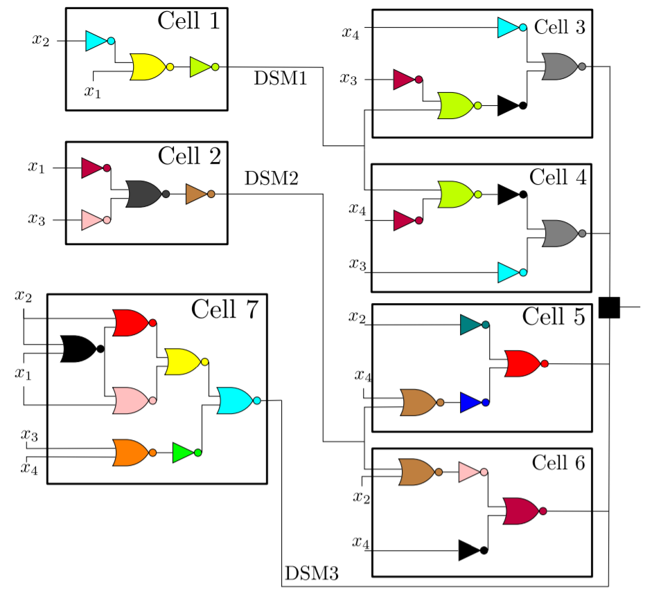
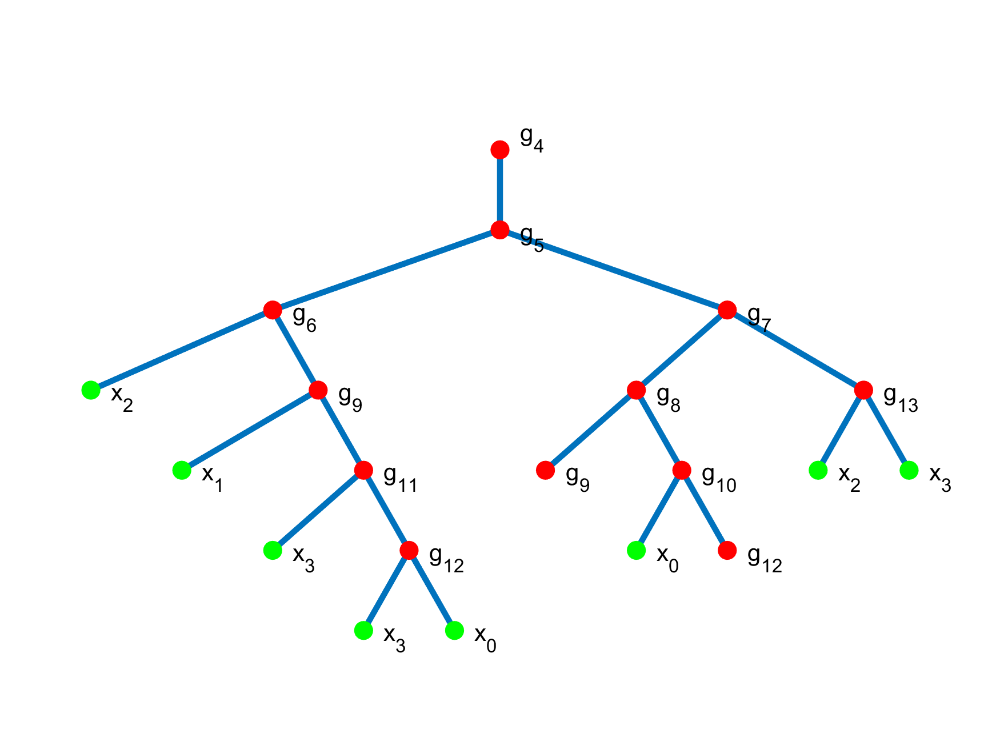

# Distributed Boolean Computing (DBC) Toolbox 
This repository was created to share the algorithm and database contained in our recent ACS Synthetic Biology paper. 
> **Distributed implementation of Boolean functions by transcriptional synthetic circuits**
> M. Ali Al-Radhawi, Anh Phong Tran, Elizabeth A. Ernst, Tianchi Chen, Christopher A. Voigt, and Eduardo D. Sontag
ACS Synthetic Biology (2020). DOI: 10.1021/acssynbio.0c00228

The code is under MIT license in order to help dissemination of the work. Please cite us if this work came to be helpful.

## Diffusible small molecules (DSM)
Oftentimes, as circuits to be implemented in a given cell becomes too large, toxicity becomes a limiting factor. This translates in practice to cells containing 6-7 gates. Only 11.69% of 4-input Boolean functions are implementable using 7 gates, so one way to alleviate this problem is allowing cells to communicate using DSMs. 

In our workflow, DSMs can be used to communicate a result from a cell to another cell located "downstream" within a circuit design. Another way is to use the output of multiple cells as an OR gate (essentially if any of the cells produce that DSM, then the output is assumed to be of value 1 regardless of concentration).

## Summary of the framework
In designing Boolean circuits in cell, there are strong biological constraints that need to be accounted for that limits how large of a circuit can one implement in a given cell. In this work, we focus on the idea of distributing the computational burden to multiple cells, while also attempting to use circuits that are optimal in the sense of how many gates are required using a pre-computed database. The main two methods that have been implemented so far are:

- Disjunctive Normal Form (DNF): this algorithm usually yields more compact designs that use less DSMs. This is based around the idea that every Boolean function can be decomposed using a disjunctive normal form and that the final result is essentially a virtual "OR" gate of all these pieces.
- Partitioning: we partition existing circuits that represent the full-fledged logical circuit from an existing database into smaller pieces that communicates using DSMs. We hope to add functions to allow communicating or importing files with other tools.
 
The internal details of how these methodologies operate can be found in the published work.

## Feedback
Feel free to suggest features or provide feedback on possible issues you may encounter using GitHub.

## Examples
#### 14 gates implemented using the DNF method using 3 cells and at most 6 gates in a cell (0x977E)

#### 13 gates using 3 DSMs and the DNF method

## Function descriptions
Since the toolbox is currently designed to use a 4-input database, the function get_decimal was created to convert a binary representation of a given Boolean function into a decimnal number that is used by the other functions in the toolbox.
> **get_decimal('1000')** 
ans = 34952
> **get_decimal('10001011')**
ans = 35723

One can then use this decimal representation to get basic information from the database:
> **get_info(35723)**
Decimal representation: 1000101110001011 
Number of gates required based on DNF decomposition (unoptimized): [1,3]
The minimum number of gates to implement in a single cell is: 4 

While more functions will be produced over time to facilitate the usability of this toolbox, the core functions are get_DNF(nb_decimal,N) and get_partition(nb_decimal,N) with N being the maximum allowed number of gates per cell.
> **get_DNF(23300,7)**

The partition function will show a graph and all possible partitions that are valid under the assumption provided by N. So far, we have written this algorithm to handle up to 2 QS, but plan on extending it.

> **get_partition(32220,8)**
Partitioning possible with g_{5} and g_{8}
Final NOR gates with 2 QS in series: 1 / 7 / 6 
>Partitioning possible with g_{6} and g_{9}
Final NOR gates with 2 QS in series: 7 / 1 / 3 
Partitioning possible with g_{7} and g_{9}
Final NOR gates with 2 QS in series: 3 / 5 / 3 
Partitioning possible with g_{7} and g_{8}
Final NOR gates with 2 QS in series: 6 / 2 / 6 
Partitioning possible with g_{7} and g_{13}
Final NOR gates with 2 QS in series: 6 / 7 / 1 
Partitioning possible with g_{7} and g_{10}
Final NOR gates with 2 QS in series: 6 / 6 / 2 
Partitioning possible with g_{7} and g_{12}
Final NOR gates with 2 QS in series: 5 / 7 / 1 
Partitioning possible with g_{9} and g_{13}
Final NOR gates with 2 QS in parallel: 7 / 3 / 1 
Partitioning possible with g_{9} and g_{10}
Final NOR gates with 2 QS in parallel: 6 / 3 / 2 
Partitioning possible with g_{8} and g_{6}
Final NOR gates with 2 QS in parallel: 4 / 6 / 4 
Partitioning possible with g_{8} and g_{9}
Final NOR gates with 2 QS in series: 5 / 3 / 3 
Partitioning possible with g_{8} and g_{13}
Final NOR gates with 2 QS in parallel: 7 / 6 / 1 
Partitioning possible with g_{8} and g_{11}
Final NOR gates with 2 QS in parallel: 6 / 6 / 2 
Partitioning possible with g_{8} and g_{12}
Final NOR gates with 2 QS in series: 7 / 5 / 1 

